# Architecture

This project is a governed account-intelligence workspace built as a React single-page application, a FastAPI service, and a canonical PostgreSQL data authority. These diagrams describe the platform-neutral production design. They intentionally omit the SQLite and development-identity paths used for local development.

## System and deployment overview

The system overview is intended for mixed stakeholder and engineering discussions. It shows the production trust boundary, runtime containers, governed data stores, release/import paths, and deployment-owned operational controls.



[Mermaid source](architecture/system-overview.mmd) · [SVG](architecture/system-overview.svg) · [PNG](architecture/system-overview.png)

## Component and data flow

The component view follows browser requests through the shared API client, Nginx, FastAPI middleware, application services, and canonical data domains. It also shows how uploaded documents become grounded assistant evidence and where the optional model-generation boundary begins.



[Mermaid source](architecture/component-data-flow.mmd) · [SVG](architecture/component-data-flow.svg) · [PNG](architecture/component-data-flow.png)

## Legend and boundaries

- Solid arrows are implemented application runtime flows.
- Dashed arrows are optional, approval-gated, or deployment-owned flows.
- Blue nodes are browser capabilities; orange nodes are network or API boundaries; green nodes are application services; purple nodes are governed data; pink nodes are optional external processing.
- PostgreSQL is the production system of record. The repository cache is hydrated from normalized records and is not a second persisted authority.
- The OpenAI path is disabled unless an approved model, credentials, and explicit external-data approval are configured. Only retrieved excerpts are sent, and provider response storage is disabled.
- SharePoint URLs are stored as document metadata; the application does not implement a SharePoint storage connector.
- Email, Teams, external source connectors, and schedulers are not active runtime integrations and are therefore excluded.

## Regenerating exports

After changing either Mermaid source, regenerate the committed SVG and PNG files:

```powershell
npm.cmd run architecture:render
```

The Mermaid sources are canonical. Commit regenerated exports with every source change so the diagrams remain usable in documentation and presentations without additional tooling.

